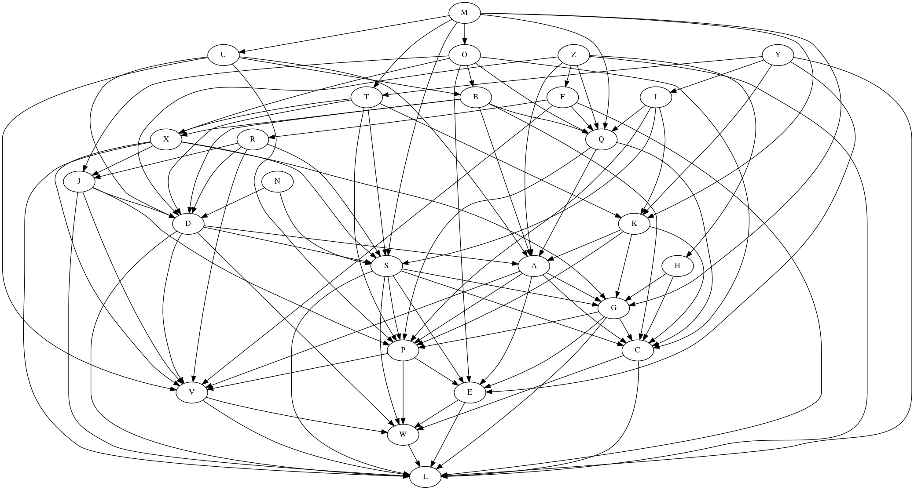

# [Advent of Code 2018](https://adventofcode.com/2018)

## Extras

### Day 3: Fabric for Santa's suit and how Elves want to cut it

Red is the claim that doesn't overlap


### Day 6:


### Day 7:



Schedule for 5 workers


### Day 10: The message appears at 10227s


## Solutions

Run with: `stack exec -- aoc2018 +RTS -N2`

``` sh
Day 1: (454,Just 566): CPU time:   0.15s
Day 2: (8610,"iosnxmfkpabcjpdywvrtahluy"): CPU time:   0.01s
Day 3: (118539,1270): CPU time:   0.63s
Day 4: (Just 67558,Just 78990): CPU time:   0.02s
Day 5: (9526,6694): CPU time:   0.06s
Day 6: (3290,45602): CPU time:   0.82s
Day 7: ("MNOUBYITKXZFHQRJDASGCPEVWL",893): CPU time:   0.00s
Day 8: (43996,35189): CPU time:   0.03s
Day 9: (374690,3009951158): CPU time:   5.99s
Day 10: ("EKALLKLB",10227): CPU time:   0.99s
Day 11: ((235,63),(16,(229,251))): CPU time:  17.17s
Extras: CPU time:  29.11s
```
