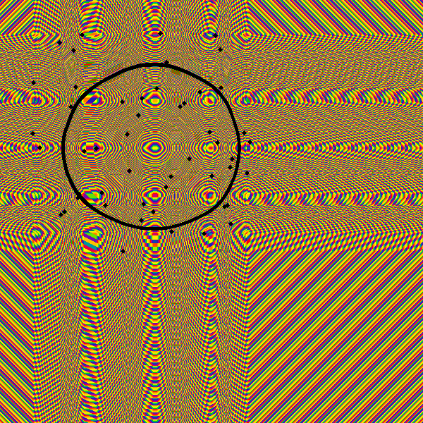

# [Advent of Code 2018](https://adventofcode.com/2018)

## Extras

### Day 3: Fabric for Santa's suit and how Elves want to cut it

Red is the claim that doesn't overlap


### Day 6:




## Solutions

``` sh
Day 1: (454,Just 566): CPU time:   0.21s
Day 2: (8610,"iosnxmfkpabcjpdywvrtahluy"): CPU time:   0.01s
Day 3: (118539,1270): CPU time:   1.02s
Day 4: (Just 67558,Just 78990): CPU time:   0.04s
Day 5: (9526,6694): CPU time:   0.09s
Day 6: (3290,45602): CPU time:   1.32s
Extras: CPU time:   8.59s
```
